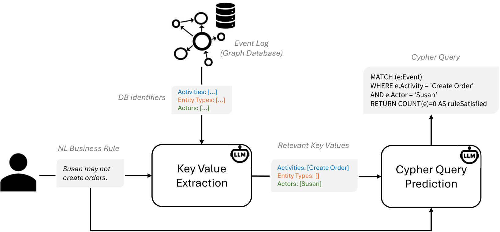
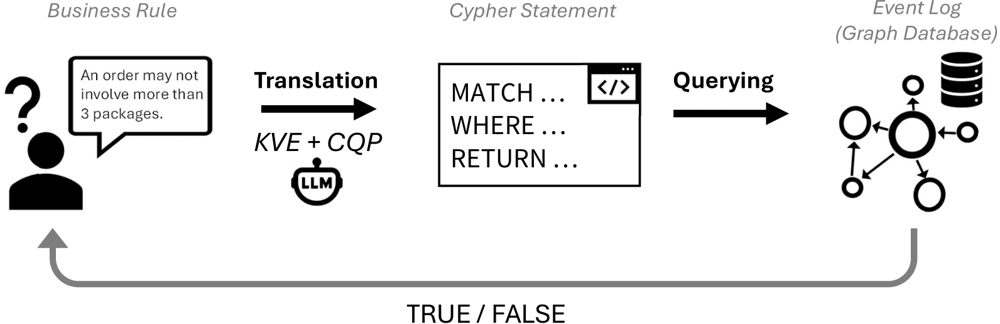

# Business Rule to Cypher

This project enables the automatic translation object-centric business rules stated in natural language into Cypher statements that check the rule on an Event Knowledge Graph (EKG) in Neo4j.
The translation pipeline consists of two steps:

1. Key Value Extraction (KVE): A few-shot prompting technique using a pretrained large language model (LLM) to identify relevant database identifiers (key values).

2. Cypher Query Prediction (CQP): A fine-tuned decoder-only LLM generates the corresponding Cypher query based on the extracted key values and the NL rule.




# 1. Fine-Tuning a LLM for Cypher Query Prediction (CQP)

The Jupyter Notebook file (`businessrule2cypher.ipynb`) provides a step-by-step guide to fine-tune a decoder-only Language Model (LLM) like Mistral's Mistral-Small-24B-Instruct using Low-Rank Adaptation (LoRA) to translate NL business rules into Cypher queries.

## Prerequisites

- Python 3.9
- Jupyter Notebook
- Necessary Python packages (specified in the notebook)
- Hugging Face API token to access the pre-trained model (https://huggingface.co/docs/hub/security-tokens)
- `path/to/data_collection.csv`: Placeholder for the data collection that is used for training and testing the model. It should be a CSV file consisting of three columns: 
  - NL input: The natural language rule.
  - Key Values: Relevant event log-specific identifiers.
  - Cypher Query: The corresponding ground truth query.
- Hardware Requirements: A CUDA-compatible GPU with at least 20 GB of memory.


## Usage
- Open `businessrule2cypher.ipynb` in Jupyter Notebook or JupyterLab.
- Follow the steps and execute each cell sequentially. The notebook contains commands to load the pretrained model, test the pretrained model, load the training data set, specify configurations for the fine-tuning process, and finally use the fine-tuned model for inference. Optionally, the user can store the fine-tuned model locally. We also provide ready-to-use LoRA adapters for both the 7B and 24 variants (`fine-tuning/lora_adapters`)


# 2. Evaluation

For the evaluation of our approach, we provide Python scripts for both the KVE and CQP modules. Also, we provide four validation sets covering NL business rules derived from two realistic object-centric event logs. Each validation set contains three columns - NL input, Key Values and Cypher Query. Thus, those can be used to evaluate both the KVE and CQP module.

## CQP 
Scripts are provided to:

1. **Predict Cypher Queries (Inference)**: Given a validation set with NL inputs and their key values, predict the corresponding Cypher queries. We provide scripts for two fine-tuned models (7B and 24B), as well as for two baseline approaches - a general fine-tuned Text-2-Cypher model and a few-shot prompting approach on the pretrained model. For the fine-tuned models, we provide the required LoRA adapters for both the 7B and 24B models. As output, we obtain a .csv file with the predictions. 
2. **Calculate translation-based score**: Given a validation set and the corresponding prediction file, calculate a translation-based (BLEU) score. 
3. **Calculate execution-based score**: Given a validation set and the corresponding prediction file, calculate an execution-based score by executing the queries. This requires a locally running Neo4j instance populated with the Event Knowledge Graph (EKG) corresponding to the respective event log.

An example predictions file is included. 

## KVE
Scripts are provided to:

1. **Extract Key Values (Inference)**: Given a validation set with NL inputs, extract the relevant key values from a predefined set of available key values uisng the few-shot prompt. As output, we obtain a .csv file with the predictions.
2. **Evaluate Key Value Extraction**: Given a validation set and the corresponding predictions file, calculate precision, recall and F1-score.

An example predictions file is included. 

# Data Collection 

`data/data_collection.csv` contains the complete data collection of natural language rules paired with relevant key values and the ground truth Cypher query that was employed for training and evaluation.

# OCEL to EKG

There is a script to transform a OCEL 2.0 event log in `jsonocel` format into an EKG in Neo4j. This assumes a locally running Neo4j instance. Also, we provide an exemplary OCEL 2.0 event log (Order Management, from https://www.ocel-standard.org/event-logs/overview/). 

# Gradio App

We provide a Gradio-based UI prototype that integrates the full pipeline. The pipeline is illustrated below:



To run the app, we assume a locally running Neo4j instance with a loaded EKG of the event log to be analyzed.

Python Version: 3.12.3 or later

Before launching the app, install the required dependencies:

```bash
pip install -r requirements.txt
```

Once dependencies are installed, run:

```bash
python gradio_app.py 
```

# Hardware Requirements
LLM inference and training steps (CQP fine-tuning, inference on LLMs, KVE prompting) require:
- CUDA-compatible GPU (min. 20 GB VRAM recommended)
  
The Gradio App assumes two CUDA-compatible GPUs of that size (one for the base model, one for the fine-tuned model).
